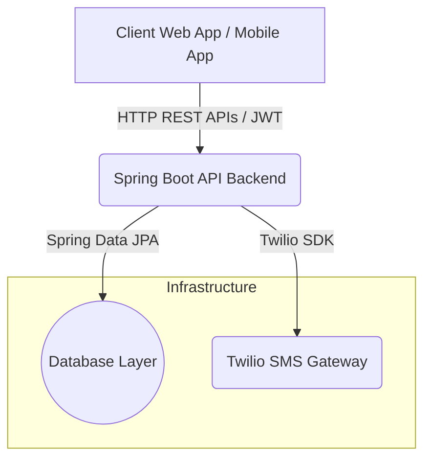

# NeSAM Technical Onboarding Guide

Welcome to the **NeSAM (Neradi Eliya Samuga Atharavu Karam)** project. This guide is designed for developers joining the project to quickly understand its domain, architecture, technologies, and setup.

---

## 1. Project Overview

### What problem this system solves
NeSAM is a community-driven alumni welfare program operated under the IRTT Alumni Association (IRTTAA). Its primary objective is to provide a unified financial support safety net for the families of deceased alumni by collectively pooling contributions.

### Domain Model & Business Context
The system pools a single **Death Fraternity Contribution (DFC)** from each active program member strictly upon the demise of another member. This pooled money is given directly to the deceased's family (nominee or legal heir) in an expedited fashion without complicated insurance hurdles.

### Program Logic & Governance
- **Membership Model:** Open to Life Members or Patron Members of IRTTAA below 60 years of age.
- **Advance DFC / Security Deposit:** At joining, members pay a refundable Advance DFC deposit (usually 5x the baseline DFC logic) along with an operational Membership Fee. It acts as a safety locker for automatic dues adjustments.
- **Death Fraternity Contribution (DFC):** Billed to active contributing members on the demise of a peer. Amount varies depending on the contributor’s age.
- **Death Settlement Mechanism:** Disbursed after outstanding DFC defaults of the deceased member are deducted. Settled per exactly configured percentage allocations across Nominees.
- **Membership Lifecycle:**
  1. **`PENDING`**: Application submitted, pending committee verification.
  2. **`ACTIVE`**: Eligible for claims and contributing DFC.
  3. **`NOTICE_PERIOD`**: Missed a DFC payment entirely. Remains active for 1 year grace but triggers warnings.
  4. **`LAPSED`**: Non-payment of DFC after notice and 15 days grace. Loss of all benefits.
  5. **`DECEASED`**: Membership closed due to demise. Settlement triggered.

> [!CAUTION]
> Revisit [Governance Docs/NESAm Invariants.md](file:///f:/NESAm%20app/Governance%20Docs/NESAm%20Invariants.md). The invariants outlined there are non-negotiable and govern logic for deposits, DFC scaling, and settlement priorities. No frontend or backend code should ever contradict them.

---

## 2. System Architecture

The NeSAM platform utilizes a traditional client-server architecture.



### Layer Responsibilities
- **Client App (React):** Handles user application forms, DFC payment views, and member dashboards.
- **Backend API (Spring Boot):** Authoritative rule engine processing user creation, One-Time-Token (OTT) security generation, and DFC calculation logic.
- **Database (PostgreSQL / MySQL):** Enforces data integrity using robust schemas and state enumerations logic.
- **External Services (Twilio):** Delivers SMS/OTP notifications to users for immediate alerts regarding Demise Events or DFC dues.

---

## 3. Tech Stack Analysis

### Frontend
- **Framework & Build:** React 19 built with Vite.
- **Routing:** `react-router-dom` (v7).
- **Libraries:** Tailwind CSS (v4) for styling, React Hook Form + Zod for robust form handling and validation, Axios for API networking.
- **Why?** Vite and React 19 ensure rapid development and modern rendering pipelines. Tailwind CSS enables fast, responsive styling necessary for a widespread alumni user base.

### Backend
- **Language:** Java 21
- **Framework:** Spring Boot 4.0.2 (using Spring WebMVC).
- **Security:** Spring Security with OAuth2 Resource Server & Spring's One-Time-Token (OTT) authentication flow.
- **Data Access:** Spring Data JPA + Hibernate.
- **Build System:** Gradle.
- **Why?** High enterprise reliability. Java 21's modern constructs paired with Spring Boot provides stable, maintainable security primitives suited for handling sensitive financial domain logic. 

### Database
- **Type:** PostgreSQL 16 (configured via Docker and properties).
- **Note:** Domain SQL design scripts ([db_scripts_v1.5.sql](file:///f:/NESAm%20app/Docs/db_scripts_v1.5.sql)) were drafted originally using MySQL constraints. See Known Issues below.

### Infrastructure & External Services
- **Containerization:** Docker & Docker Compose setup for the Database (`postgres` and `pgadmin4`).
- **External:** Twilio SDK for alerts and SMS notifications.

---

## 4. Repository Structure

```text
├── Docs/                    # Requirement/Business docs: SRS, FAQS, Domain ER diagrams
├── Governance Docs/         # Domain Canon & Invariants (CRITICAL: Read these first!)
├── nesam-api/               # Backend Java API Workspace
│   └── nesam/               # Spring Boot Application root (build.gradle)
└── reactjs-starter/         # Frontend Workspace
    └── reactjs-starter/     # React 19 Vite App
```

Highlight files to read first:
1. [Governance Docs/NESAm Domain Canon.md](file:///f:/NESAm%20app/Governance%20Docs/NESAm%20Domain%20Canon.md)
2. [Governance Docs/NESAm Invariants.md](file:///f:/NESAm%20app/Governance%20Docs/NESAm%20Invariants.md)
3. [Docs/db_scripts_v1.5.sql](file:///f:/NESAm%20app/Docs/db_scripts_v1.5.sql)

---

## 5. Backend Deep Dive

The backend relies heavily on robust Spring Boot conventions.

- **Structure:** Packages in `org.irtt.nesam` are segmented into `web` (controllers), `services` (business logic domain), `data` (models and repositories), and `configuration` (security/swagger).
- **Entities & Relationships:** Built using JPA matching the SQL schemas. Core models involve [UserProfile](file:///f:/NESAm%20app/nesam-api/nesam/src/main/java/org/irtt/nesam/services/MembershipService.java#23-39), [Membership](file:///f:/NESAm%20app/nesam-api/nesam/src/main/java/org/irtt/nesam/services/MembershipService.java#40-66), `Nominee`, and `TransactionLedger`.
- **Controllers:** Currently, [ProfileController](file:///f:/NESAm%20app/nesam-api/nesam/src/main/java/org/irtt/nesam/web/ProfileController.java#25-104) handles endpoint routing starting with `/api/v1/users`.
- **Security / Auth Flow:** Employs a magic link/OTP style flow via Spring Security's `OneTimeTokenService`. `/ott/dispatch` generates the token, and `/ott/login` trades the consumed OTT for a standard JWT token.
- **Execution Path:** Request -> [ProfileController](file:///f:/NESAm%20app/nesam-api/nesam/src/main/java/org/irtt/nesam/web/ProfileController.java#25-104) -> [MembershipService](file:///f:/NESAm%20app/nesam-api/nesam/src/main/java/org/irtt/nesam/services/MembershipService.java#15-67)/`UserProfileService` -> JPA Repositories -> Database Entity.

---

## 6. Database Model

The database serves as the absolute enforcement of invariants.

- **`user_profiles`**: Maps UUID to Mobile logins.
- **`memberships`**: Connects User to the NeSAM program instances identifying Status (`ACTIVE`, `LAPSED` etc.) and tracking the `security_deposit_balance`.
- **`nominees`**: Enforces strict nominee percentage constraints.
- **`transaction_ledger`**: Append-only audit table tracking `CREDIT`, `DEBIT`, and `DEMAND`.
- **`settlement_records`**: A frozen snapshot preserving the history of death claim distributions.
- **System Configs (`system_parameters`, `master_fee_slabs`, `master_dfc_rates`)**: Drive dynamic system behavior.

> [!WARNING]
> While [db_scripts_v1.5.sql](file:///f:/NESAm%20app/Docs/db_scripts_v1.5.sql) provides MySQL syntax with specific enums and checks, the backend configuration ([application.yml](file:///f:/NESAm%20app/nesam-api/nesam/src/main/resources/application.yml) and [docker-compose.yml](file:///f:/NESAm%20app/nesam-api/nesam/docker-compose.yml)) points to a **PostgreSQL** instance!

---

## 7. Frontend Deep Dive

The React frontend handles the structural scaffolding:
- **[main.jsx](file:///f:/NESAm%20app/reactjs-starter/reactjs-starter/src/main.jsx) & [App.jsx](file:///f:/NESAm%20app/reactjs-starter/reactjs-starter/src/App.jsx)**: Bootstraps standard page routes leveraging React Router.
- **API Communication**: The boilerplate initializes Axios inside [package.json](file:///f:/NESAm%20app/reactjs-starter/reactjs-starter/package.json) indicating a unified networking approach that's meant to interface with the `/api/v1/*` backend via `services/` components.
- **Current State**: Primarily a fresh starter Vite setup scaffolding components, features, and API directories. 

---

## 8. External Integrations

- **Twilio SMS:** Injected into backend dependencies (`com.twilio.sdk:twilio`); used implicitly via service notification dispatch mechanics to message users for DFC demand notices and registration.
- **Payment Verification:** (Future scope) Expected to be handled via webhook parsing on transaction completion endpoints integrating with conventional providers.

---

## 9. Prerequisites to Run the Project

1. **Java 21** Engine installed locally.
2. **Node.js** (v18.x or v20.x minimum).
3. **Gradle** (or rely on embedded Gradlew wrappers).
4. **Docker Desktop / Engine** (Required for localized Postgres DB).
5. Environment capability for reading [./docker-test-password.txt](file:///f:/NESAm%20app/nesam-api/nesam/docker-test-password.txt) and passing DB configurations.

---

## 10. Environment Setup

### 10.1 Database Initialization 
1. Open terminal at `f:/NESAm app/nesam-api/nesam/`.
2. Boot PostgreSQL + pgAdmin using:
   ```bash
   docker-compose up -d
   ```
3. Initialize schemas via `pgadmin` or CLI connection using configurations mapped via [application.yml](file:///f:/NESAm%20app/nesam-api/nesam/src/main/resources/application.yml) referencing the PostgreSQL schema. You will need to convert some [db_scripts_v1.5.sql](file:///f:/NESAm%20app/Docs/db_scripts_v1.5.sql) schemas safely syntax mapping them for Postgres.

### 10.2 Backend Setup
1. Inside `nesam-api/nesam/`:
2. Modify `application.yml` database bounds if necessary (e.g. `POSTGRES_PASSWORD`).
3. Run backend build compilation to install all dependencies:
   ```bash
   ./gradlew clean build
   ```

### 10.3 Frontend Setup
1. Inside `reactjs-starter/reactjs-starter/`:
2. Install Javascript dependencies:
   ```bash
   npm install
   ```

---

## 11. Running the System Locally

**Start Backend App:**
```bash
cd nesam-api/nesam
./gradlew bootRun
```
_Verify API available at:_ `http://localhost:9090`  
_Open Swagger UI to execute queries:_ `http://localhost:9090/swagger-ui/index.html`

**Start Frontend Application:**
```bash
cd reactjs-starter/reactjs-starter
npm run dev
```
_Verify Website running at:_ `http://localhost:5173` (Vite Default)

---

## 12. Docker Setup

A complete local database environment is provisioned structurally.
- **`postgres:16`**: Boots on default port `5432` binding standard credentials injected securely via `secrets` -> `db-password`.
- **`pgadmin`**: A robust admin pane linked to your postgres container accessible via port `8080`.
Run `docker-compose up -d` to turn them all on. The API application code is not containerized initially, letting developers use IDE debugging locally.

---

## 13. Development Workflow

1. Discuss and evaluate Domain Model logic using `Governance Docs/` rules.
2. Draft API structure utilizing `ProfileController` as a reference. Add JPA models inside `data/models`.
3. Add backend domain execution flows to `services/`.
4. Refresh DB states locally (if schema changes exist).
5. Build Frontend Components consuming backend Swagger definitions using Axios and React Hook Form workflows under `src/components`.

---

## 14. Known Issues or Risks

1. **Database Script Engine Mismatch:** Legal documentation and initialization script is geared for MySQL 8.0, but backend and Docker Compose enforces PostgreSQL 16. Needs immediate refactoring to align schemas before persistence runs predictably.
2. **Incomplete Frontend Modules:** The React directory acts mainly as boilerplate. Implementation of forms matching NeSAM's requirements does not exist yet.
3. **Skeleton Authentication Mechanics:** OAuth2 OTT generation is deployed on endpoints safely, but endpoints for complete application authorization are still raw.

---

## 15. Quick Onboarding Guide (First 15 Minutes)

1. **(Minute 0-5) Understand the law:** Read `Governance Docs/NESAm Invariants.md` to see exactly how funds lock and resolve. 
2. **(Minute 5-8) Boot the system:** Run `docker-compose up -d` from the backend directory to open your Postgres environment.
3. **(Minute 8-12) Interact with API:** Start Spring Boot and navigate to `http://localhost:9090/swagger-ui.html`. Dispatch a dummy test OTT ticket hitting the `/api/v1/users/register` endpoints.
4. **(Minute 12-15) Read DB Setup Schema:** Review `Docs/db_scripts_v1.5.sql` noting how constraints link member statuses logically against transaction records to prevent rule manipulation.
