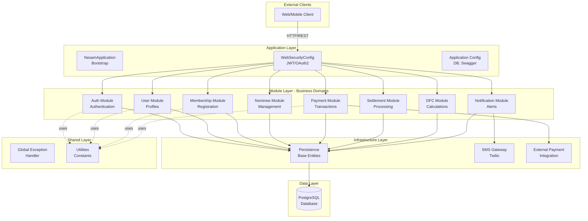
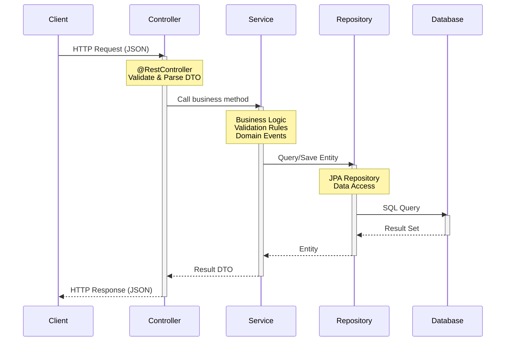
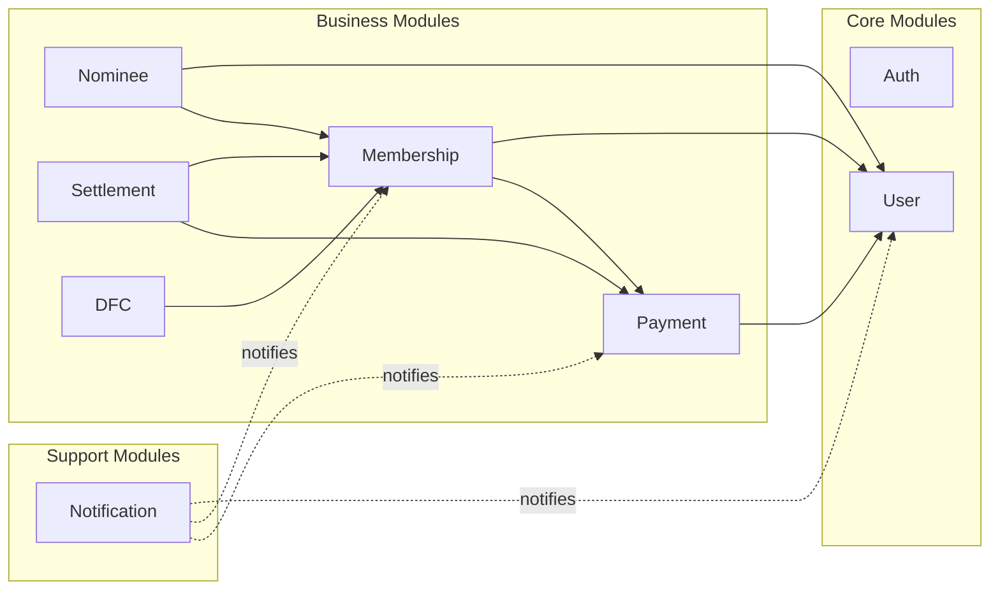
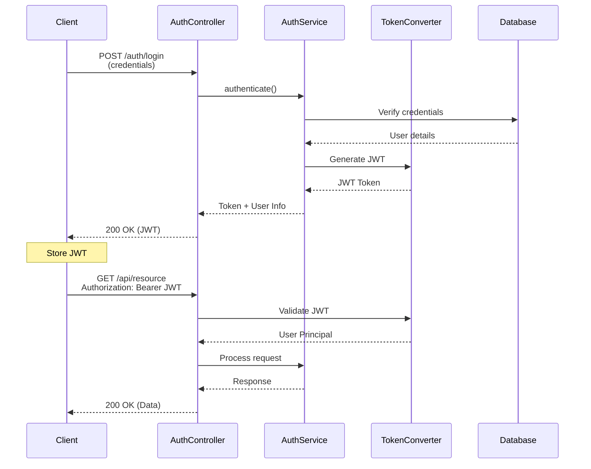

# Architecture Overview

## Table of Contents
- [Technology Stack](#technology-stack)
- [Architecture Pattern](#architecture-pattern)
- [System Layers](#system-layers)
- [Design Principles](#design-principles)
- [Architecture Diagram](#architecture-diagram)

## Technology Stack

### Core Technologies
| Component | Technology | Version |
|-----------|-----------|---------|
| **Framework** | Spring Boot | 4.0.2 |
| **Language** | Java | 21 |
| **Build Tool** | Gradle | (wrapper included) |
| **Database** | PostgreSQL | - |
| **ORM** | Spring Data JPA | (Hibernate) |

### Key Dependencies
| Library | Purpose |
|---------|---------|
| **Spring Security** | Authentication & Authorization |
| **Spring OAuth2 Resource Server** | JWT token validation |
| **Lombok** | Reduce boilerplate code |
| **SpringDoc OpenAPI** | API documentation (Swagger UI) |
| **Twilio SDK** | SMS notifications |
| **HikariCP** | Database connection pooling |

### Development Tools
- **API Documentation**: Swagger UI at `/swagger-ui.html`
- **API Specs**: OpenAPI 3.0 at `/v3/api-docs`
- **Database Migration**: SQL scripts in `docs/` folder

## Architecture Pattern

### Domain-Driven Design (DDD)
The application follows **Domain-Driven Design** principles with a focus on:
- **Bounded Contexts**: Each module represents a bounded context
- **Rich Domain Models**: Business logic lives in domain models
- **Domain Events**: Event-driven communication between modules
- **Business Rules**: Encapsulated in domain rule classes
- **Ubiquitous Language**: Consistent terminology across code and business

### Layered Architecture
The system implements a **clean layered architecture** with clear separation of concerns:

```
┌─────────────────────────────────────┐
│     Presentation Layer              │
│     (Controllers/REST APIs)         │
└─────────────┬───────────────────────┘
              │
┌─────────────▼───────────────────────┐
│     Application Layer               │
│     (Services/Use Cases)            │
└─────────────┬───────────────────────┘
              │
┌─────────────▼───────────────────────┐
│     Domain Layer                    │
│     (Models/Rules/Events)           │
└─────────────┬───────────────────────┘
              │
┌─────────────▼───────────────────────┐
│     Infrastructure Layer            │
│     (Repositories/External)         │
└─────────────────────────────────────┘
```

## System Layers

### 1. Application Layer (`app/`)
**Purpose**: Application bootstrapping and cross-cutting configurations

```
app/
├── bootstrap/          # Application entry point
│   └── NesamApplication.java
├── config/             # Application configuration
│   ├── DatasourceConfig.java
│   └── SwaggerConfig.java
└── security/           # Security configuration
    └── WebSecurityConfig.java
```

**Responsibilities**:
- Application startup and initialization
- Database configuration (connection pooling, JPA settings)
- Security configuration (OAuth2, JWT, CORS)
- API documentation configuration (Swagger/OpenAPI)

### 2. Modules Layer (`modules/`)
**Purpose**: Business domain modules (bounded contexts)

Each module follows a consistent internal structure:
```
module-name/
├── controller/         # REST API endpoints
├── service/           # Business logic & orchestration
├── repository/        # Data access layer
├── domain/            # Core domain layer
│   ├── model/        # Domain entities
│   ├── rules/        # Business rules & validation
│   ├── events/       # Domain events
│   └── enums/        # Domain enumerations
├── dto/              # Data Transfer Objects
│   ├── request/      # Request DTOs
│   └── response/     # Response DTOs
└── mapper/           # Entity-DTO mappers
```

**Available Modules**:
1. `auth` - Authentication & authorization
2. `user` - User profile management
3. `membership` - Membership lifecycle
4. `nominee` - Nominee management
5. `payment` - Payment processing
6. `settlement` - Settlement processing
7. `dfc` - DFC calculations
8. `notification` - Notifications

### 3. Infrastructure Layer (`infrastructure/`)
**Purpose**: Technical infrastructure and external integrations

```
infrastructure/
├── persistence/       # Base entities & persistence utilities
│   └── BaseEntity.java
├── sms/              # SMS gateway integration
│   └── SmsGateway.java
└── external/         # External service clients
    └── ExternalPaymentClient.java
```

**Responsibilities**:
- Base entity classes for JPA
- External service integrations (SMS, payment gateways)
- Technical utilities and helpers

### 4. Shared Layer (`shared/`)
**Purpose**: Cross-cutting concerns and utilities

```
shared/
├── constants/        # Application-wide constants
├── dto/             # Shared DTOs
├── events/          # Base domain event classes
├── exception/       # Global exception handling
└── utils/           # Utility classes
```

**Responsibilities**:
- Global exception handlers
- Shared constants and enumerations
- Common utility functions (date utils, etc.)
- Base event classes

## Design Principles

### 1. Modularity
- Each business domain is self-contained in its own module
- Minimal coupling between modules
- Clear module boundaries and responsibilities

### 2. Single Responsibility
- Controllers handle HTTP concerns only
- Services contain business logic
- Repositories manage data access
- Domain models encapsulate business rules

### 3. Dependency Inversion
- Layers depend on abstractions (interfaces)
- Repository interfaces define contracts
- Services depend on repository interfaces, not implementations

### 4. Domain-Centric Design
- Business logic lives in domain layer
- Rich domain models with behavior
- Business rules explicitly defined
- Domain events for loose coupling

### 5. Separation of Concerns
- DTOs for data transfer (decoupled from entities)
- Mappers for transformation logic
- Validators for business rules
- Exception handlers for error management

## Architecture Diagram

### High-Level System Architecture



### Request Flow



### Module Dependencies



## Key Architectural Decisions

### 1. Why Modular DDD?
- **Scalability**: Modules can be extracted into microservices later
- **Maintainability**: Clear boundaries make code easier to understand
- **Team Collaboration**: Different teams can work on different modules
- **Business Alignment**: Code structure matches business domains

### 2. Why Layered Architecture?
- **Separation of Concerns**: Each layer has a specific responsibility
- **Testability**: Layers can be tested in isolation
- **Flexibility**: Easy to swap implementations (e.g., different databases)
- **Standards**: Industry-standard pattern familiar to developers

### 3. Why Spring Boot?
- **Rapid Development**: Auto-configuration and starter dependencies
- **Production Ready**: Built-in monitoring, health checks, metrics
- **Ecosystem**: Rich ecosystem of libraries and integrations
- **Security**: Robust security framework (Spring Security)

### 4. Why PostgreSQL?
- **ACID Compliance**: Strong data consistency guarantees
- **JSON Support**: Native JSON/JSONB for flexible data
- **Performance**: Excellent performance for complex queries
- **Open Source**: No licensing costs

## Security Architecture

### Authentication Flow



### Security Features
- **JWT Tokens**: Stateless authentication with RSA keys
- **OAuth2 Resource Server**: Token-based authorization
- **Role-Based Access Control**: Different permissions per role
- **CORS Configuration**: Controlled cross-origin access
- **Password Security**: Bcrypt hashing (if implemented)

## Configuration

### Database Configuration
```yaml
spring:
  datasource:
    url: ${DB_URL:jdbc:postgresql://localhost:5432/nesam_db}
    username: ${DB_USERNAME:postgres}
    password: ${DB_PASSWORD}
    hikari:
      connectionTimeout: 20000
      maximumPoolSize: 5
  jpa:
    hibernate.ddl-auto: none
    properties.hibernate.dialect: PostgreSQLDialect
```

### Server Configuration
```yaml
server:
  port: 9090
```

### JWT Configuration
```yaml
jwt:
  private.key: classpath:private_key.pem
  public.key: classpath:test-pub.pem
```

## Next Steps
- Review [Module Guide](MODULE_GUIDE.md) for detailed module information
- Check [Folder Structure](FOLDER_STRUCTURE.md) for complete directory layout
- See [Development Guide](DEVELOPMENT_GUIDE.md) to start contributing
