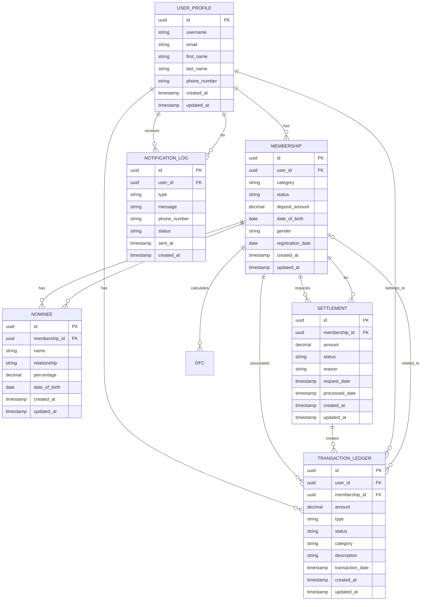

# Database Schema

Database structure and entity relationships for the NESAm backend.

## Table of Contents
- [Database Overview](#database-overview)
- [Entity Relationships](#entity-relationships)
- [Entity Details](#entity-details)
- [Migration Scripts](#migration-scripts)

## Database Overview

**Database**: PostgreSQL  
**ORM**: Hibernate (via Spring Data JPA)  
**Connection Pool**: HikariCP  
**Schema Management**: Manual SQL scripts

### Connection Configuration
```yaml
spring:
  datasource:
    url: ${DB_URL:jdbc:postgresql://localhost:5432/nesam_db}
    username: ${DB_USERNAME:postgres}
    password: ${DB_PASSWORD}
    hikari:
      connectionTimeout: 20000
      maximumPoolSize: 5
  jpa:
    hibernate.ddl-auto: none  # Manual schema management
    properties.hibernate.dialect: PostgreSQLDialect
```

## Entity Relationships

### ER Diagram



## Entity Details

### Base Entity

All entities inherit from `BaseEntity`:

**Class**: `infrastructure/persistence/BaseEntity.java`

```java
@MappedSuperclass
public abstract class BaseEntity {
    @Id
    @GeneratedValue(strategy = GenerationType.IDENTITY)
    private Long id;
    
    @CreatedDate
    @Column(nullable = false, updatable = false)
    private LocalDateTime createdAt;
    
    @LastModifiedDate
    private LocalDateTime updatedAt;
}
```

**Common Fields**:
- `id`: Primary key (auto-generated)
- `created_at`: Timestamp when record was created
- `updated_at`: Timestamp when record was last updated

---

### User Profile

**Entity**: `modules/user/domain/model/UserProfile.java`  
**Table**: `user_profile` (estimated)

```java
@Entity
@Table(name = "user_profile")
@Builder
@Data
public class UserProfile extends BaseEntity {
    @Column(unique = true, nullable = false)
    private String username;
    
    @Column(unique = true, nullable = false)
    private String email;
    
    private String firstName;
    private String lastName;
    
    @Column(unique = true)
    private String phoneNumber;
    
    // One-to-many relationships
    @OneToMany(mappedBy = "user")
    private List<Membership> memberships;
    
    @OneToMany(mappedBy = "user")
    private List<TransactionLedger> transactions;
}
```

**Key Fields**:
- `username`: Unique username for login
- `email`: Unique email address
- `first_name`, `last_name`: User's full name
- `phone_number`: Contact number (for SMS notifications)

**Relationships**:
- One user can have multiple memberships
- One user can have multiple transactions

---

### Membership

**Entity**: `modules/membership/domain/model/Membership.java`  
**Table**: `membership` (estimated)

```java
@Entity
@Table(name = "membership")
public class Membership extends BaseEntity {
    @ManyToOne
    @JoinColumn(name = "user_id", nullable = false)
    private UserProfile user;
    
    @Enumerated(EnumType.STRING)
    private MembershipCategory category;
    
    @Enumerated(EnumType.STRING)
    private MembershipStatus status;
    
    @Column(nullable = false)
    private BigDecimal depositAmount;
    
    private LocalDate dateOfBirth;
    
    @Enumerated(EnumType.STRING)
    private GenderType gender;
    
    private LocalDate registrationDate;
    
    // One-to-many relationships
    @OneToMany(mappedBy = "membership")
    private List<Nominee> nominees;
}
```

**Key Fields**:
- `user_id`: Foreign key to UserProfile
- `category`: Membership type (enum)
- `status`: Current status (ACTIVE, INACTIVE, etc.)
- `deposit_amount`: Initial deposit amount
- `date_of_birth`: Member's date of birth
- `gender`: Member's gender
- `registration_date`: When membership was created

**Enums**:
- **MembershipCategory**: Different membership tiers
- **MembershipStatus**: ACTIVE, INACTIVE, SUSPENDED, PENDING
- **GenderType**: MALE, FEMALE, OTHER

**Relationships**:
- Many memberships belong to one user
- One membership can have multiple nominees

**Business Rules**:
- Age eligibility checked via `AgeEligibilityRule`
- Status transitions controlled by `StatusTransitionRule`
- Deposit validated by `DepositPolicy`

---

### Nominee

**Entity**: `modules/nominee/domain/model/Nominee.java`  
**Table**: `nominee` (estimated)

```java
@Entity
@Table(name = "nominee")
public class Nominee extends BaseEntity {
    @ManyToOne
    @JoinColumn(name = "membership_id", nullable = false)
    private Membership membership;
    
    @Column(nullable = false)
    private String name;
    
    private String relationship;
    
    @Column(nullable = false)
    @Min(0)
    @Max(100)
    private BigDecimal percentage;
    
    private LocalDate dateOfBirth;
}
```

**Key Fields**:
- `membership_id`: Foreign key to Membership
- `name`: Nominee's full name
- `relationship`: Relationship to member (SPOUSE, CHILD, etc.)
- `percentage`: Allocation percentage (must sum to 100%)
- `date_of_birth`: Nominee's date of birth

**Business Rules**:
- Total percentage of all nominees for a membership must equal 100%
- Enforced by `NomineePercentageRule`

---

### Transaction Ledger

**Entity**: `modules/payment/domain/model/TransactionLedger.java`  
**Table**: `transaction_ledger` (estimated)

```java
@Entity
@Table(name = "transaction_ledger")
public class TransactionLedger extends BaseEntity {
    @ManyToOne
    @JoinColumn(name = "user_id", nullable = false)
    private UserProfile user;
    
    @ManyToOne
    @JoinColumn(name = "membership_id")
    private Membership membership;
    
    @Column(nullable = false)
    private BigDecimal amount;
    
    @Enumerated(EnumType.STRING)
    private TransactionType type;
    
    @Enumerated(EnumType.STRING)
    private TransactionStatus status;
    
    @Enumerated(EnumType.STRING)
    private TransactionCategory category;
    
    private String description;
    
    private LocalDateTime transactionDate;
}
```

**Key Fields**:
- `user_id`: Foreign key to UserProfile
- `membership_id`: Foreign key to Membership (optional)
- `amount`: Transaction amount
- `type`: Transaction type (enum)
- `status`: Transaction status (enum)
- `category`: Transaction category (enum)
- `description`: Additional details
- `transaction_date`: When transaction occurred

**Enums**:
- **TransactionType**: DEPOSIT, WITHDRAWAL, TRANSFER, REFUND
- **TransactionStatus**: PENDING, COMPLETED, FAILED, CANCELLED
- **TransactionCategory**: MEMBERSHIP_FEE, MONTHLY_DEPOSIT, SETTLEMENT, etc.

**Business Rules**:
- Enforced by `LedgerPolicy`
- All financial transactions must be recorded
- Immutable after completion

---

### Settlement

**Entity**: Likely in `modules/settlement/domain/model/`  
**Table**: `settlement` (estimated)

```java
@Entity
@Table(name = "settlement")
public class Settlement extends BaseEntity {
    @ManyToOne
    @JoinColumn(name = "membership_id", nullable = false)
    private Membership membership;
    
    @Column(nullable = false)
    private BigDecimal amount;
    
    @Enumerated(EnumType.STRING)
    private SettlementStatus status;
    
    private String reason;
    
    private LocalDateTime requestDate;
    private LocalDateTime processedDate;
}
```

**Key Fields**:
- `membership_id`: Foreign key to Membership
- `amount`: Settlement amount
- `status`: REQUESTED, APPROVED, PROCESSED, REJECTED
- `reason`: Reason for settlement
- `request_date`: When settlement was requested
- `processed_date`: When settlement was completed

**Business Rules**:
- Governed by `SettlementPolicy`
- Distribution to nominees based on percentages

---

### DFC (Likely a calculation/rate table)

**Entity**: Likely in `modules/dfc/domain/model/`  
**Repository**: `modules/dfc/repository/DfcRepository.java`

```java
@Entity
@Table(name = "dfc_rate")
public class DfcRate extends BaseEntity {
    private String rateType;
    private BigDecimal rateValue;
    private LocalDate effectiveFrom;
    private LocalDate effectiveTo;
}
```

**Key Fields**:
- `rate_type`: Type of rate
- `rate_value`: Numeric rate value
- `effective_from`: Start date for rate
- `effective_to`: End date for rate

**Business Rules**:
- `DfcRateResolver` determines applicable rate
- `DfcCalculator` performs calculations

---

### Notification Log

**Entity**: `modules/notification/domain/model/NotificationLog.java`  
**Table**: `notification_log` (estimated)

```java
@Entity
@Table(name = "notification_log")
public class NotificationLog extends BaseEntity {
    @ManyToOne
    @JoinColumn(name = "user_id", nullable = false)
    private UserProfile user;
    
    @Enumerated(EnumType.STRING)
    private NotificationType type;
    
    @Column(nullable = false, length = 1000)
    private String message;
    
    private String phoneNumber;
    
    @Enumerated(EnumType.STRING)
    private NotificationStatus status;
    
    private LocalDateTime sentAt;
    
    private String errorMessage;
}
```

**Key Fields**:
- `user_id`: Foreign key to UserProfile
- `type`: SMS, EMAIL, PUSH (extensible)
- `message`: Notification content
- `phone_number`: Recipient phone (for SMS)
- `status`: SENT, FAILED, PENDING
- `sent_at`: Timestamp of delivery attempt
- `error_message`: Error details if failed

---

## Indexes and Constraints

### Recommended Indexes
```sql
-- User lookups
CREATE INDEX idx_user_username ON user_profile(username);
CREATE INDEX idx_user_email ON user_profile(email);
CREATE INDEX idx_user_phone ON user_profile(phone_number);

-- Membership queries
CREATE INDEX idx_membership_user ON membership(user_id);
CREATE INDEX idx_membership_status ON membership(status);

-- Nominee lookups
CREATE INDEX idx_nominee_membership ON nominee(membership_id);

-- Transaction queries
CREATE INDEX idx_transaction_user ON transaction_ledger(user_id);
CREATE INDEX idx_transaction_membership ON transaction_ledger(membership_id);
CREATE INDEX idx_transaction_date ON transaction_ledger(transaction_date);
CREATE INDEX idx_transaction_status ON transaction_ledger(status);

-- Notification queries
CREATE INDEX idx_notification_user ON notification_log(user_id);
CREATE INDEX idx_notification_sent_at ON notification_log(sent_at);
```

### Foreign Key Constraints
- All `*_id` fields should have foreign key constraints
- Cascade rules depend on business requirements
- Typically: `ON DELETE RESTRICT` for referential integrity

---

## Migration Scripts

**Location**: `nesam-api/nesam/docs/`

### Available Scripts
- `db_scripts_v1.5.sql` - Version 1.5 schema
- `db_scripts_v1.6_postgres.sql` - Version 1.6 PostgreSQL schema

### Schema Management Strategy
- **Hibernate DDL Auto**: `none` (manual migrations)
- **Approach**: SQL migration scripts
- **Versioning**: Version numbered scripts

### Creating Migrations
1. Create new `.sql` file in `docs/` folder
2. Name with version: `db_scripts_v{version}.sql`
3. Include both DDL (CREATE TABLE, ALTER TABLE) and data changes
4. Test on development database first
5. Apply to production with backup

---

## Data Types

### Common PostgreSQL Mappings
| Java Type | PostgreSQL Type | Notes |
|-----------|----------------|-------|
| `String` | `VARCHAR` or `TEXT` | Based on length |
| `Long` | `BIGINT` | Default for IDs |
| `Integer` | `INTEGER` | - |
| `BigDecimal` | `NUMERIC(precision, scale)` | For money |
| `LocalDate` | `DATE` | - |
| `LocalDateTime` | `TIMESTAMP` | - |
| `Boolean` | `BOOLEAN` | - |
| `Enum` | `VARCHAR` | @Enumerated(STRING) |
| `UUID` | `UUID` | Native PostgreSQL type |

---

## Querying the Database

### JPA Repository Pattern
```java
public interface UserRepository extends JpaRepository<UserProfile, Long> {
    Optional<UserProfile> findByUsername(String username);
    Optional<UserProfile> findByEmail(String email);
    List<UserProfile> findByFirstNameContaining(String name);
}
```

### Custom Queries
```java
@Query("SELECT m FROM Membership m WHERE m.status = :status AND m.user.id = :userId")
List<Membership> findByStatusAndUser(@Param("status") MembershipStatus status, 
                                      @Param("userId") Long userId);
```

### Native SQL
```java
@Query(value = "SELECT * FROM transaction_ledger WHERE amount > ?1", 
       nativeQuery = true)
List<TransactionLedger> findLargeTransactions(BigDecimal minAmount);
```

---

## Database Initialization

### Development
```yaml
spring:
  jpa:
    hibernate.ddl-auto: none  # Don't auto-create schema
  sql:
    init:
      mode: always  # Run init scripts
      schema-locations: classpath:schema.sql
      data-locations: classpath:data.sql
```

### Production
- Use manual migration scripts
- Never use `ddl-auto: create` or `update`
- Always backup before schema changes
