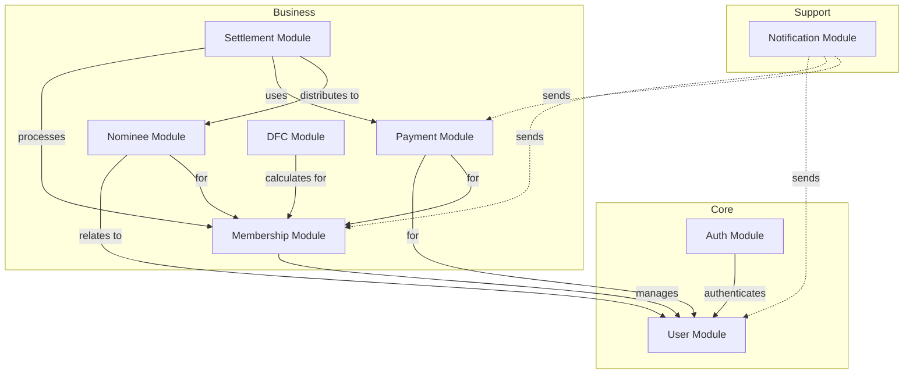

# Module Guide

This guide provides detailed information about each business module in the NESAm backend.

## Table of Contents
- [Module Overview](#module-overview)
- [Auth Module](#auth-module)
- [User Module](#user-module)
- [Membership Module](#membership-module)
- [Nominee Module](#nominee-module)
- [Payment Module](#payment-module)
- [Settlement Module](#settlement-module)
- [DFC Module](#dfc-module)
- [Notification Module](#notification-module)

## Module Overview

Each module follows a consistent structure:

```
module-name/
├── controller/         # REST API endpoints (@RestController)
├── service/           # Business logic (@Service)
├── repository/        # Data access (@Repository)
├── domain/            # Core domain layer
│   ├── model/        # JPA entities (@Entity)
│   ├── rules/        # Business rules & validators
│   ├── events/       # Domain events
│   └── enums/        # Domain enumerations
├── dto/              # Data Transfer Objects
│   ├── request/      # Request DTOs
│   └── response/     # Response DTOs
└── mapper/           # Entity-DTO mappers
```

---

## Auth Module

**Path**: `org.irtt.nesam.modules.auth`

### Purpose
Handles authentication and authorization for the entire application using JWT tokens and OAuth2.

### Components

#### Controllers
- **AuthController** (`controller/AuthController.java`)
  - Handles login/logout endpoints
  - Token generation and validation
  - User authentication

#### Services
- **TokenConverter** (`service/TokenConverter.java`)
  - Converts JWT tokens to authentication objects
  - Validates token signatures using RSA keys
  
- **TokenAuthenticationConverter** (`service/TokenAuthenticationConverter.java`)
  - Spring Security integration for token-based auth
  - Extracts user details from tokens
  
- **ConsoleOTTHandler** (`service/ConsoleOTTHandler.java`)
  - Handles One-Time Token (OTT) for console access
  - Development/testing utility

### Key Features
- JWT token generation with RSA keys
- OAuth2 resource server integration
- Token-based stateless authentication
- Role and permission management

### Dependencies
- Uses: `User Module` (for user details)
- Used by: All protected endpoints

### Security Configuration
- Private key: `private_key.pem`
- Public key: `test-pub.pem`
- Configuration in: `WebSecurityConfig.java`

---

## User Module

**Path**: `org.irtt.nesam.modules.user`

### Purpose
Manages user profiles and account information.

### Components

#### Controllers
- **UserController** (`controller/UserController.java`)
  - User profile CRUD operations
  - Profile update endpoints
  - User information retrieval

#### Services
- **UserService** (`service/UserService.java`)
  - User management business logic
  - Profile creation and updates
  
- **UserProfileService** (`service/UserProfileService.java`)
  - Extended profile management
  - Profile validation

#### Repositories
- **UserRepository** (`repository/UserRepository.java`)
  - JPA repository for User entities
  - Custom queries for user lookup

#### Domain Models
- **UserProfile** (`domain/model/UserProfile.java`)
  - Main user entity
  - Contains user personal information
  - Uses Lombok @Builder pattern

#### DTOs
- **UserProfileRequestDTO** (`dto/request/`)
  - Request payload for user operations
  
- **UserProfileResponseDTO** (`dto/response/`)
  - Response format for user data
  - Uses Lombok @Builder

#### Mappers
- **UserMapper** (`mapper/UserMapper.java`)
  - Converts between UserProfile entity and DTOs
  - Handles data transformation

### Database Table
- **user_profile** (or similar)
  - Stores user personal information
  - Primary key: user ID

### Key Features
- User profile management
- Profile validation
- User information queries

### Dependencies
- Used by: `Membership`, `Nominee`, `Payment` modules

---

## Membership Module

**Path**: `org.irtt.nesam.modules.membership`

### Purpose
Manages the complete membership lifecycle including registration, renewals, and status management.

### Components

#### Controllers
- **MembershipController** (`controller/MembershipController.java`)
  - Membership registration
  - Membership renewal
  - Status updates and queries

#### Services
- **MembershipService** (`service/MembershipService.java`)
  - Core membership business logic
  - Registration processing
  - Status transitions
  - Validation orchestration

#### Repositories
- **MembershipRepository** (`repository/MembershipRepository.java`)
  - JPA repository for Membership entities
  - Custom queries for membership lookup

#### Domain Models
- **Membership** (`domain/model/Membership.java`)
  - Core membership entity
  - Membership details and status
  - Relationship with User

#### Domain Rules
- **AgeEligibilityRule** (`domain/rules/AgeEligibilityRule.java`)
  - Validates age requirements for membership
  
- **DepositPolicy** (`domain/rules/DepositPolicy.java`)
  - Enforces deposit requirements
  
- **MembershipValidator** (`domain/rules/MembershipValidator.java`)
  - Comprehensive membership validation
  
- **StatusTransitionRule** (`domain/rules/StatusTransitionRule.java`)
  - Controls valid status transitions

#### Domain Events
- **MemberRegisteredEvent** (`domain/events/MemberRegisteredEvent.java`)
  - Published when new member registers
  - Triggers notifications and other workflows

#### Domain Enums
- **MembershipStatus** (`domain/enums/MembershipStatus.java`)
  - ACTIVE, INACTIVE, SUSPENDED, etc.
  
- **MembershipCategory** (`domain/enums/MembershipCategory.java`)
  - Different membership types
  
- **GenderType** (`domain/enums/GenderType.java`)
  - Gender enumeration

#### DTOs
- **MembershipRequestDTO** (`dto/request/`)
  - Registration/update requests
  
- **MembershipResponseDTO** (`dto/response/`)
  - Membership data responses

#### Mappers
- **MembershipMapper** (`mapper/MembershipMapper.java`)
  - Entity-DTO transformation

### Key Features
- Member registration with validation
- Age eligibility checking
- Deposit policy enforcement
- Status transition management
- Domain event publishing

### Business Rules
1. Age must meet minimum requirements
2. Deposit must be paid before activation
3. Status transitions must follow defined rules
4. Category determines membership benefits

### Dependencies
- Uses: `User Module`, `Payment Module`
- Used by: `Nominee`, `Settlement`, `DFC` modules

---

## Nominee Module

**Path**: `org.irtt.nesam.modules.nominee`

### Purpose
Manages nominees for members, including percentage allocation and validation.

### Components

#### Controllers
- **NomineeController** (`controller/NomineeController.java`)
  - Add/update/remove nominees
  - Query nominee information
  - Percentage allocation management

#### Services
- **NomineeService** (`service/NomineeService.java`)
  - Nominee management logic
  - Percentage validation
  - Nominee relationship management

#### Repositories
- **NomineeRepository** (`repository/NomineeRepository.java`)
  - JPA repository for Nominee entities
  - Queries by member ID

#### Domain Models
- **Nominee** (`domain/model/Nominee.java`)
  - Nominee entity
  - Relationship with Membership
  - Percentage allocation

#### Domain Rules
- **NomineePercentageRule** (`domain/rules/NomineePercentageRule.java`)
  - Ensures total percentage = 100%
  - Validates individual percentages

#### Mappers
- **NomineeMapper** (`mapper/NomineeMapper.java`)
  - Entity-DTO transformation

### Key Features
- Multiple nominees per member
- Percentage allocation (must total 100%)
- Nominee validation
- Relationship management

### Business Rules
1. Total nominee percentages must equal 100%
2. Each percentage must be > 0%
3. Member can have multiple nominees
4. Nominee changes require validation

### Dependencies
- Uses: `User Module`, `Membership Module`
- Used by: `Settlement Module`

---

## Payment Module

**Path**: `org.irtt.nesam.modules.payment`

### Purpose
Handles all payment processing, transaction management, and ledger maintenance.

### Components

#### Controllers
- **PaymentController** (`controller/PaymentController.java`)
  - Process payments
  - Query transactions
  - Transaction status updates

#### Services
- **PaymentService** (`service/PaymentService.java`)
  - Payment processing logic
  - Transaction creation
  - Ledger management
  - Integration with external payment systems

#### Domain Models
- **TransactionLedger** (`domain/model/TransactionLedger.java`)
  - Transaction records
  - Financial ledger entries
  - Audit trail

#### Domain Rules
- **LedgerPolicy** (`domain/rules/LedgerPolicy.java`)
  - Ledger entry validation
  - Transaction rules

#### Domain Enums
- **TransactionType** (`domain/enums/TransactionType.java`)
  - DEPOSIT, WITHDRAWAL, TRANSFER, etc.
  
- **TransactionStatus** (`domain/enums/TransactionStatus.java`)
  - PENDING, COMPLETED, FAILED, etc.
  
- **TransactionCategory** (`domain/enums/TransactionCategory.java`)
  - Categories of transactions

#### DTOs
- **TransactionDTO** (`dto/request/TransactionDTO.java`)
  - Transaction request/response format

#### Mappers
- **PaymentMapper** (`mapper/PaymentMapper.java`)
  - Transaction entity-DTO mapping

### Key Features
- Payment processing
- Transaction ledger
- Multiple transaction types
- External payment gateway integration
- Transaction audit trail

### Business Rules
1. All transactions must be recorded in ledger
2. Transaction status must be tracked
3. Failed transactions must be logged
4. Transaction types determine processing logic

### Dependencies
- Uses: `User Module`, `Membership Module`
- Uses: `ExternalPaymentClient` (infrastructure)
- Used by: `Membership`, `Settlement` modules

---

## Settlement Module

**Path**: `org.irtt.nesam.modules.settlement`

### Purpose
Handles settlement processing, likely for member withdrawals or benefit disbursements.

### Components

#### Controllers
- **SettlementController** (`controller/SettlementController.java`)
  - Settlement requests
  - Settlement processing
  - Settlement status queries

#### Services
- **SettlementService** (`service/SettlementService.java`)
  - Settlement calculation
  - Settlement processing logic
  - Nominee distribution

#### Domain Rules
- **SettlementPolicy** (`domain/rules/SettlementPolicy.java`)
  - Settlement eligibility rules
  - Calculation policies

#### Mappers
- **SettlementMapper** (`mapper/SettlementMapper.java`)
  - Settlement entity-DTO mapping

### Key Features
- Settlement processing
- Nominee-based distribution
- Policy-based calculations
- Settlement validation

### Business Rules
1. Settlement eligibility must be verified
2. Distribution follows nominee percentages
3. Settlement policies determine amounts
4. Settlement requires authorization

### Dependencies
- Uses: `Membership Module`, `Payment Module`, `Nominee Module`

---

## DFC Module

**Path**: `org.irtt.nesam.modules.dfc`

### Purpose
Manages DFC (Daily Financial Calculation or similar) rates and calculations.

### Components

#### Controllers
- **DfcController** (`controller/DfcController.java`)
  - DFC queries
  - Rate management

#### Services
- **DfcService** (`service/DfcService.java`)
  - DFC calculation logic
  - Rate application

#### Repositories
- **DfcRepository** (`repository/DfcRepository.java`)
  - DFC data access

#### Domain Rules
- **DfcRateResolver** (`domain/rules/DfcRateResolver.java`)
  - Determines applicable rates
  
- **DfcCalculator** (`domain/rules/DfcCalculator.java`)
  - Performs DFC calculations

### Key Features
- Rate calculation
- Rate resolution based on criteria
- DFC data management

### Dependencies
- Uses: `Membership Module`

---

## Notification Module

**Path**: `org.irtt.nesam.modules.notification`

### Purpose
Manages notifications and notification logging across the system.

### Components

#### Controllers
- **NotificationController** (`controller/NotificationController.java`)
  - Send notifications
  - Query notification history
  - Notification status

#### Services
- **NotificationService** (`service/NotificationService.java`)
  - Notification sending logic
  - SMS integration
  - Notification logging

#### Repositories
- **NotificationRepository** (`repository/NotificationRepository.java`)
  - Notification log persistence

#### Domain Models
- **NotificationLog** (`domain/model/NotificationLog.java`)
  - Notification audit log
  - Delivery status tracking

### Key Features
- SMS notifications via Twilio
- Notification logging
- Delivery status tracking
- Multi-channel support (extensible)

### Dependencies
- Uses: `SmsGateway` (infrastructure)
- Used by: All modules (for notifications)

---

## Module Interaction Diagram



## Common Patterns Across Modules

### 1. Controller Pattern
```java
@RestController
@RequestMapping("/api/module-name")
public class ModuleController {
    @Autowired
    private ModuleService service;
    
    @GetMapping
    public ResponseDTO getAll() {
        return service.findAll();
    }
}
```

### 2. Service Pattern
```java
@Service
public class ModuleService {
    @Autowired
    private ModuleRepository repository;
    
    @Autowired
    private ModuleMapper mapper;
    
    public ResponseDTO create(RequestDTO dto) {
        // Business logic
        Entity entity = mapper.toEntity(dto);
        Entity saved = repository.save(entity);
        return mapper.toDTO(saved);
    }
}
```

### 3. Repository Pattern
```java
@Repository
public interface ModuleRepository extends JpaRepository<Entity, Long> {
    // Custom queries
    Optional<Entity> findBySomeField(String field);
}
```

### 4. Domain Model Pattern
```java
@Entity
@Table(name = "table_name")
@Builder
@Data
public class DomainModel extends BaseEntity {
    @Id
    @GeneratedValue(strategy = GenerationType.IDENTITY)
    private Long id;
    
    // Fields and relationships
}
```
